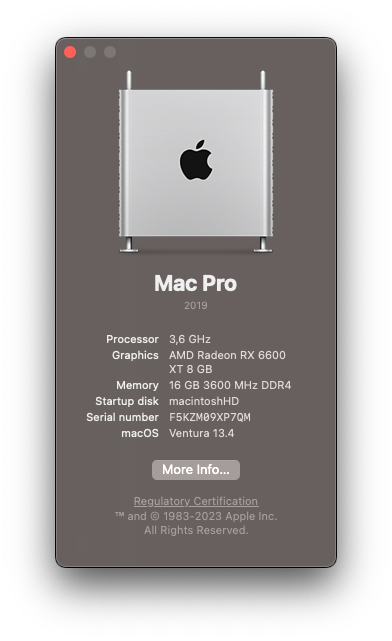

# Hackintosh on ASRock B550M Steel Legend using OpenCore

# Spec Sheet
| Part        | Specs                               |
|-------------|-------------------------------------|
| CPU         | R5-3600                             |
| Mobo        | ASRock B550M Steel Legend           |
| RAM         | 16GB(Team Elite Black Plus @3200Mhz)|
| GPU1        | MSI Radeon RX 6600 XT Mech 2x OC    |
| WiFi        | DW1820A                             |

# Working
1. QE/CI
2. All USB
3. Wireless AC
4. Bluetooth
5. Power Management
6. Appstore
7. iMessage

# Not Working 
1. Motherboard Audio Realtek ALC1200

# Instalation
## Bios Settings
* Exit → Load UEFI BIOS Defaults [Yes]
* Boot → CSM (Compatibility Support Module) → CSM [Disabled]
* Advanced → PCI Configuration → Above 4G Decoding [Enabled]
* Advanced → PCI Configuration → Re-Size BAR Support [Disabled]
* Advanced → Storage Configuration → SATA Mode [AHCI]
* Security → Secure Boot → Secure Boot [Disabled]
* Boot → Fast Boot [Disabled]

# Gathering Files
## ACPI
- [SSDT-CPUR](https://github.com/dortania/Getting-Started-With-ACPI/blob/master/extra-files/compiled/SSDT-CPUR.aml)
- [SSDT-EC-USBX-DESKTOP](https://github.com/dortania/Getting-Started-With-ACPI/blob/master/extra-files/compiled/SSDT-EC-USBX-DESKTOP.aml)

## Kexts
- [AirportBrcmFixup](https://github.com/acidanthera/AirportBrcmFixup) remove the `AirPortBrcm4360_Injector`
- [AMDRyzenCPUPowerManagement](https://github.com/trulyspinach/SMCAMDProcessor)
- [AppleALC](https://github.com/acidanthera/AppleALC)
- [AppleMCEReporterDisabler](https://github.com/acidanthera/bugtracker/files/3703498/AppleMCEReporterDisabler.kext.zip)
- [ASRock-B550M-STEEL-LEGEND-USB](https://github.com/teimor/OpenCore_ASRock-B550M_RX6800XT/tree/main/USB%20Kexts/iMacPro1%2C1)
- [Lilu](https://github.com/acidanthera/Lilu)
- [LucyRTL8125Ethernet](https://github.com/Mieze/LucyRTL8125Ethernet)
- [RestrictEvents](https://github.com/acidanthera/RestrictEvents)
- [SMCAMDProcessor](https://github.com/trulyspinach/SMCAMDProcessor)
- [VirtualSMC](https://github.com/acidanthera/VirtualSMC)
- [WhateverGreen](https://github.com/acidanthera/WhateverGreen)
# References
1. [Dortania's guide](https://github.com/dortania/vanilla-laptop-guide)
2. [AMD-OSX's Patches](https://github.com/AMD-OSX/AMD_Vanilla)
3. [Hackintosh Reddit and Discord](https://reddit.com/r/hackintosh)
